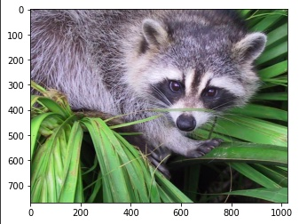

# NumPy is the mathematical powerhouse for multidimensional array manipulation. 
- 👋 Hi, I’m @WilliamSpanfelner
- 👀 I’m interested in using Python with Swift in iOS environments and why it may or may not be desirable.
- 🌱 I’m currently learning Python with the London App Brewery and Angela Yu's [100 Days of Code: 
The Complete Python Pro Bootcamp for 2022](https://www.udemy.com/course/100-days-of-code/) on Udemy.  
- 🧑‍💻  This project explores some vector, matrix and tensor operation and applies these principles to photographic processing operations.  Create black and white images from your own images, rotate them, flip them and learn some interesting techniques for working with multi-dimensional arrays.
- 💞️ I’m looking to collaborate on application development.
- 📫 How to reach me...

[//]: # ([![email](https://img.shields.io/badge/email-wil--1--am%40outlook.com-grey?style=plastic)](mailto:wil-1-am@outlook.com))

